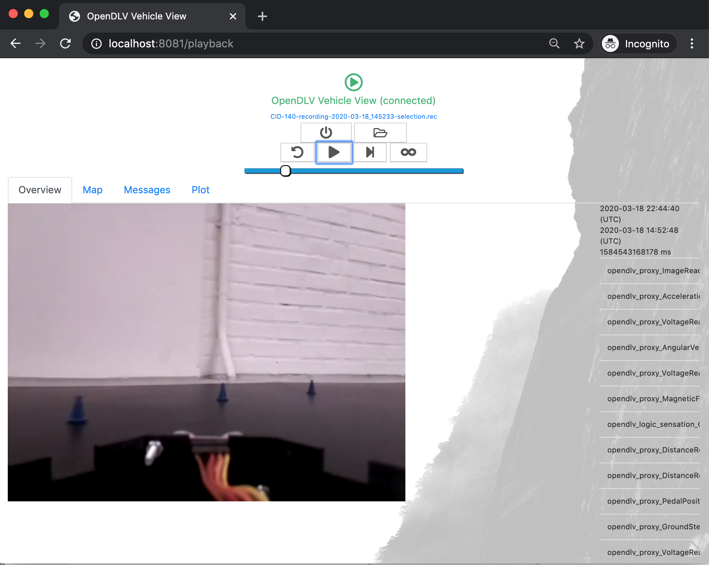
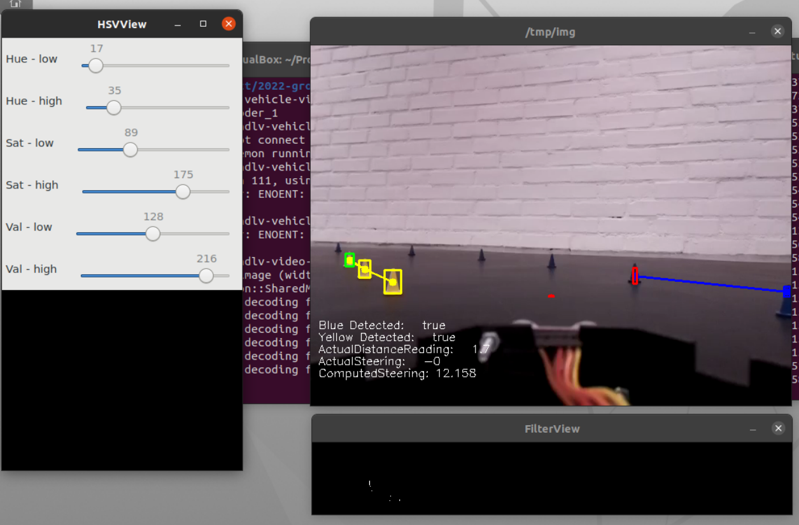

# 2022-group-05
### Pipeline status
](https://git.chalmers.se/courses/dit638/students/2022-group-05/-/commits/main)

## Getting started


1. To clone this repository, you need to have an active [SSH key](https://docs.gitlab.com/ee/user/ssh.html) on your PC and Gitlab. To confirm that you currently have an SSH key, open a terminal and use the following command: 

    ```shell 
    cat ~/.ssh/id_ed25519.pub                                     
    ```
    - If you already have an active SSH key, skip to #4.

---


2. To generate SSH keys, use the following command:

    ```
    ssh-keygen -t ed25519 -C "<comment>"                      
    ```

    The following prompt is shown, choose a file **or** hit enter to accept the standard file location (recommended):

    ```
    Enter file in which to save the key (/home/<yourcomputer>/.ssh/id_ed25519): 
    ```

    Enter a password for the SSH key and press enter. This step is repeated to confirm the password.

    ```
    Enter passphrase (empty for no passphrase): 
    ```
---
3. Add the SSH key to Gitlab.  
    
    Start by copying the key to clipboard:
    #### Mac
    ```
    pbcopy < ~/.ssh/id_rsa.pub
    ```
    #### Linux (Ubuntu)
    ```
    cat ~/.ssh/id_rsa.pub
    ```
    - (copy the output)
    </br>
    </br>

    #### Windows (Git Bash)
    ```
    clip < ~/.ssh/id_rsa.pub
    ```

    Once logged in on [Gitlab](https://git.chalmers.se/), click on your avatar and Navigate to 'Preferences'.  
    You will see the following screen:

    

    Paste the copied SSH key and add a title and an expiry date.

---

4. To clone the repository, click the blue "Clone"
 dropdown and copy the url under "Clone with SSH" as displayed here:

    

    Open a terminal, create and then navigate to a folder where you want to clone the repository:

    ``` 
    mkdir project
    ```

    ``` 
    cd project
    ```

    Clone the repository using the following command:

    ```
    git clone git@git.chalmers.se:courses/dit638/students/2022...
    ```

---

5. Set up Docker in order to run the project. There are various ways to install docker. Follow the instructions for your specific setup at [installation](https://docs.docker.com/get-docker/) and more information on [Docker Compose](https://docs.docker.com/compose/install/).

    Once you've downloaded docker, navigate to the project repository folder, where the Dockerfile is located, in your terminal and run the following command:
    ```
    docker-compose up
    ```

    This will start the [OpenDLV-Vehicle-View](https://github.com/chalmers-revere/opendlv-vehicle-view) and the h264 decoder. You should see a message ending with something similar the following **before** proceeding:
    ```
    server listening on port: 8081, joining live OD4Session 111, using OD4Session 253 for playback.
    ```

    Then point your browser (preferably Chrome 80+) to: http://localhost:8081 

    Click on the folder on the top center bar and then choose a file to inspect by clicking the small playbutton next to the bin symbol. You should see a view with the video as well as some playback options. 

    

    Now, open another terminal and navigate to the same folder as previously. Then run the following command:
    ```
    make build
    ```
    This will build the project and attach to the shared memory. 
    
    Once completed, you can run with the following command:

    ```
    make run
    ```
    Now navigate to the web application where the video is running again and play the video. Three new windows should pop up, in addition to output being printed to the terminal:
    
    

    Note: In the case that you are pulling the image from the group's release tag, you will instead need to use the following command in the terminal. You will need to provide the release hash in the indicated <> space:


```sh
docker run --rm -ti --net=host --ipc=host -e DISPLAY=$DISPLAY -v /tmp:/tmp registry.git.chalmers.se/courses/dit638/students/2022-group-05:<release> --cid=253 --name=img --width=640 --height=480 --output=example.csv
```
## Feature management

1. The process that our team will follow for **new features** incorporates these steps:  

    1. Team discussion and aproval of feature.
    2. Feature is added to requirements and user stories/tasks are created
    3. User stories/task are added to the product backlog on [Trello](https://trello.com/). 
    4. During sprint planning, team members pull tasks from the product backlog to the sprint backlog and assign themselves. During the sprint, the feature will move through phases of 'Ongoing', 'To be reviewed', 'Done'.
    5. An appropriate matching issue will be created by the assignee on gitlab referencing the milestone the feature belongs to.
    6. The assignee branches from main, using a branch name that specifies the feature. 
        - Commits will be done at minimum on a daily basis where the issue will be added to the commit message.
    7. When the task is complete, the assignee will create a merge request with detail concerning the work they have completed and how it solves the issue. 
        - They will also select a reviewer during this process. 
    8. Review will be completed, and if the code is satisfactory the merge will be finalised with the main branch.
    9. During the sprint review, the feature will be demonstrated and will be approved/delayed by the team.

---

2. The process that our team will follow for **unexpected behaviour** incorporates these steps: 

    1. The team identifies existing unexpected behaviour in the project and discusses the priority of the issue.
    2. If the unexpected behaviour is affecting the functionality of the project, the task is added to the sprint backlog and assigned to a team member that has time to complete the task within the current or at maximum the next sprint.
        - If the flaw is not affecting the functionality of the project, the task is added to the product backlog and is handled as per the normal feature steps.
    3. The team will be updated daily concerning the feature related to the unexpected behaviour and assistance will be provided to the assignee on an ongoing basis.
    4. When the task is complete, the assignee will create a merge request with detail concerning the work they have completed and how it solves the issue. They will also select a reviewer during this process. 
    5. Review will be completed, and if the code is satisfactory the merge will be finalised with the main branch.
    6. During the sprint review, the feature will be demonstrated and will be approved/delayed by the team.

---

3. The process that our team will follow for **commit messages** incorporates these steps: 
    1. The commit messages shall include a short description of the intention of the completed code as well as the issue number related to the commit.
    </br>
    </br>

    Example of non-accepted structure:
    ```
    "this is a commit"
    ```

    Example of accepted structure
    ```
    "added front IR sensor reading #2"
    ```

---

## Contact
### For further information, the contributors can be contacted:
Drake Axelrod - drake@draxel.io  
Klara Svensson - gussvekla@student.gu.se  
Sicily Brannen - gusbrannsi@student.gu.se  
Vernita Gouws - gusgouve@student.gu.se 
